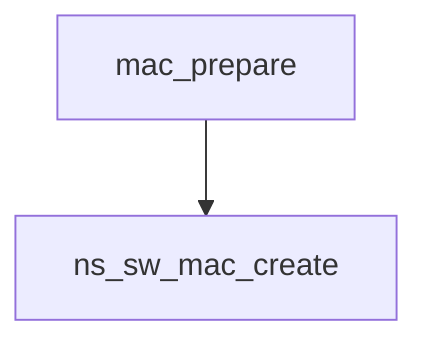
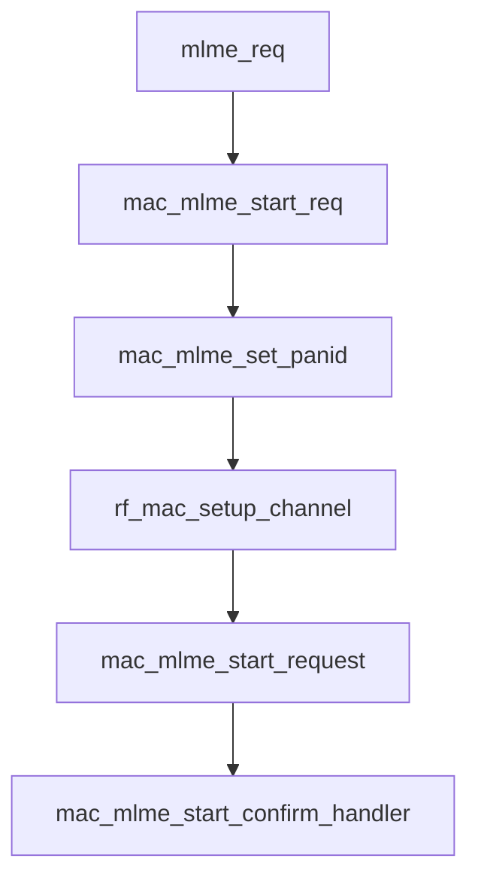
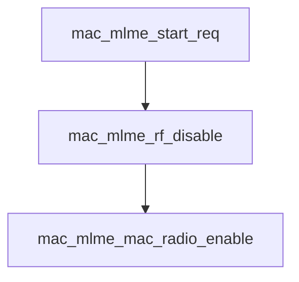

## mbed-os-example-mesh 
**sw mac**

```c
static int mac_prepare(void)
{
    NanostackRfPhy &rf_phy = NanostackRfPhy::get_default_instance();
    int8_t rf_driver_id = rf_phy.rf_register();
    uint8_t rf_eui64[8];

    if (rf_driver_id < 0) {
        tr_error("Failed to register RF driver.");
        return -1;
    }
    rf_phy.get_mac_address(rf_eui64);
    mac_description_storage_size_t mac_description;
    mac_description.device_decription_table_size = DEVICE_DESCRIPTOR_TABLE_SIZE;    /** MAC Device description list size */
    mac_description.key_description_table_size = KEY_DESCRIPTOR_TABLE_SIZE;         /** MAC Key description list size */
    mac_description.key_lookup_size = LOOKUP_DESCRIPTOR_TABLE_SIZE;                 /** Key description key lookup list size */
    mac_description.key_usage_size = USAGE_DESCRIPTOR_TABLE_SIZE;                   /** Key description key usage list size */
    tr_info("Registered RF driver with id: %hhu, EUI64: %s", rf_driver_id, mbed_trace_array(rf_eui64, 8));
    mac_interface = ns_sw_mac_create(rf_driver_id, &mac_description);
    if (!mac_interface) {
        tr_error("Failed to create SW MAC.");
        return -2;
    }

    return mac_interface->mac_initialize(mac_interface, mac_data_confirm_handler,
                                         mac_data_indication_handler, mac_purge_confirm_handler, mac_mlme_confirm_handler,
                                         mac_mlme_indication_handler, rf_driver_id);
}
```

```c
mac_api_t *ns_sw_mac_create(int8_t rf_driver_id, mac_description_storage_size_t *storage_sizes)
{
    //TODO: Refactor this away, Drivers should be stored in MAC layer in future
    if (!storage_sizes || !storage_sizes->device_decription_table_size || !storage_sizes->key_description_table_size || !storage_sizes->key_lookup_size || !storage_sizes->key_usage_size) {
        return NULL;
    }

    arm_device_driver_list_s *driver = arm_net_phy_driver_pointer(rf_driver_id);

    if (!driver || !driver->phy_driver) {
        return NULL;
    }
    mac_api_t *this = ns_dyn_mem_alloc(sizeof(mac_api_t));
    if (!this) {
        return NULL;
    }
    memset(this, 0, sizeof(mac_api_t));
    this->parent_id = -1;
    mac_store.dev_driver = driver;
    mac_store.setup = mac_mlme_data_base_allocate(mac_store.dev_driver->phy_driver->PHY_MAC, mac_store.dev_driver, storage_sizes);

    if (!mac_store.setup) {
        ns_dyn_mem_free(this);
        return NULL;
    }

    arm_net_phy_init(driver->phy_driver, &sw_mac_net_phy_rx, &sw_mac_net_phy_tx_done);
    arm_net_virtual_config_rx_cb_set(driver->phy_driver, &sw_mac_net_phy_config_parser);
    arm_net_virtual_confirmation_rx_cb_set(driver->phy_driver, &mac_mlme_virtual_confirmation_handle);

    this->mac_initialize = &ns_sw_mac_initialize;
    this->mac_mcps_extension_enable = &ns_sw_mac_api_enable_mcps_ext;
    this->mlme_req = &mlme_req;
    this->mcps_data_req = &mcps_req;
    this->mcps_data_req_ext = &mcps_req_ext;
    this->mcps_purge_req = &purge_req;
    this->mac64_get = &macext_mac64_address_get;
    this->mac64_set = &macext_mac64_address_set;
    this->mac_storage_sizes_get = &sw_mac_storage_decription_sizes_get;
    this->phyMTU = driver->phy_driver->phy_MTU;

    mac_store.mac_api = this;

    mac_store.virtual_driver = NULL;
    return this;
}
```


```c
struct mac_api_s {
    mac_api_initialize          *mac_initialize;                /**< MAC initialize function to use */
    mac_api_enable_mcps_ext     *mac_mcps_extension_enable;     /**< MAC MCPS IE extension enable function, optional feature */
    //External MAC callbacks
    mlme_request                *mlme_req;                      /**< MAC MLME request function to use */
    mcps_data_request           *mcps_data_req;                 /**< MAC MCPS data request function to use */
    mcps_data_request_ext       *mcps_data_req_ext;             /**< MAC MCPS data request with Information element extension function to use */
    mcps_purge_request          *mcps_purge_req;                /**< MAC MCPS purge request function to use */

    //Upper layer callbacksMLME_ASSOCIATE
    mcps_data_confirm           *data_conf_cb;                  /**< MAC MCPS data confirm callback function */
    mcps_data_confirm_ext       *data_conf_ext_cb;              /**< MAC MCPS data confirm with payload callback function */
    mcps_data_indication        *data_ind_cb;                   /**< MAC MCPS data indication callback function */
    mcps_data_indication_ext    *data_ind_ext_cb;               /**< MAC MCPS data indication with IE extension's callback function */
    mcps_ack_data_req_ext       *enhanced_ack_data_req_cb;      /**< Enhanced ACK IE element and payload request from MAC user */
    mcps_purge_confirm          *purge_conf_cb;                 /**< MAC MCPS purge confirm callback function */
    mlme_confirm                *mlme_conf_cb;                  /**< MAC MLME confirm callback function */
    mlme_indication             *mlme_ind_cb;                   /**< MAC MLME indication callback function */
    mac_ext_mac64_address_set   *mac64_set;                     /**< MAC extension function to set mac64 address */
    mac_ext_mac64_address_get   *mac64_get;                     /**< MAC extension function to get mac64 address */
    mac_storage_decription_sizes_get *mac_storage_sizes_get;    /**< Getter function to query data storage sizes from MAC */

    int8_t                      parent_id;                      /**< Upper layer id */
    uint16_t                    phyMTU;                         /**< Maximum Transmission Unit(MTU) used by MAC*/
};
```

**usig mlme**

```c
/*!
 * \enum mlme_primitive
 * \brief Enum for MLME primitive types.
 */
typedef enum {
    MLME_ASSOCIATE,
    MLME_DISASSOCIATE,
    MLME_BEACON_NOTIFY,
    MLME_GET,
    MLME_GTS,
    MLME_ORPHAN,
    MLME_RESET,
    MLME_RX_ENABLE,
    MLME_SCAN,
    MLME_COMM_STATUS,
    MLME_SET,
    MLME_START,
    MLME_SYNC,
    MLME_SYNC_LOSS,
    MLME_POLL
} mlme_primitive;
```


```c
int mac_address_command(int argc, char *argv[])
{
    char *str;
    uint8_t ext_addr[8];

    if (cmd_parameter_val(argc, argv, "--64-bit", &str)) {
        if (string_to_bytes(str, ext_addr, 8) != 0) {
            return CMDLINE_RETCODE_INVALID_PARAMETERS;
        }
        mac_interface->mac64_set(mac_interface, ext_addr);
        cmd_printf("64-bit MAC address set to: %s\n", trace_array(ext_addr, 8));
    } else if (cmd_parameter_val(argc, argv, "--16-bit", &str)) {
        uint32_t short_addr_32 = strtoul(str, NULL,  16);
        if (short_addr_32 <= 0xFFFF) {
            uint16_t short_addr = short_addr_32;
            mlme_set_t set_req;
            set_req.attr = macShortAddress;
            set_req.value_pointer = &short_addr;
            set_req.value_size = 2;
            mac_interface->mlme_req(mac_interface, MLME_SET, &set_req);
            cmd_printf("16-bit MAC address set to: 0x%04X\n", short_addr);
        } else {
            tr_warn("Invalid 16-bit MAC address given: %lu", short_addr_32);
        }
    } else if (argc == 1) {
        if (mac_interface->mac64_get(mac_interface, MAC_EXTENDED_READ_ONLY, ext_addr) == 0) {
            cmd_printf("EUI64: %s\n", trace_array(ext_addr, 8));
        } else {
            tr_warn("Failed to read EUI64");
            return CMDLINE_RETCODE_FAIL;
        }
        if (mac_interface->mac64_get(mac_interface, MAC_EXTENDED_DYNAMIC, ext_addr) == 0) {
            cmd_printf("MAC64: %s\n", trace_array(ext_addr, 8));
        } else {
            tr_warn("Failed to read MAC64");
            return CMDLINE_RETCODE_FAIL;
        }
    } else {
        return CMDLINE_RETCODE_INVALID_PARAMETERS;
    }
    return CMDLINE_RETCODE_SUCCESS;
}
```
## sw_mac.c ##
```c
void mlme_req(const mac_api_t *api, mlme_primitive id, const void *data)
{
    if (mac_store.mac_api != api) {
        return;
    }
    //TODO: cast & handle
    switch (id) {
        case MLME_ASSOCIATE: {
            break;
        }
        case MLME_DISASSOCIATE: {
            break;
        }
        case MLME_GET: {
            mlme_get_conf_t get_confirm;
            const mlme_get_t *dat = (const mlme_get_t *)data;
            memset(&get_confirm, 0, sizeof(mlme_get_conf_t));
            get_confirm.attr = dat->attr;
            get_confirm.attr_index = dat->attr_index;

            if (mac_mlme_get_req(mac_store.setup, &get_confirm) == 0) {
                //call configured confirmation
                api->mlme_conf_cb(api, MLME_GET, &get_confirm);
            }

            break;
        }
        case MLME_GTS: {
            //Unsupported
            break;
        }
        case MLME_RESET: {
            const mlme_reset_t *dat = (const mlme_reset_t *)data;
            mac_mlme_reset(mac_store.setup, dat);
            break;
        }
        case MLME_RX_ENABLE: {
            break;
        }
        case MLME_SCAN: {
            const mlme_scan_t *dat = (const mlme_scan_t *)data;
            if (mac_store.dev_driver->phy_driver->arm_net_virtual_tx_cb) {
                virtual_data_req_t scan_req;
                uint8_t buf_temp[2];
                uint8_t scan_req_temp[47];

                build_virtual_scan_request(dat, scan_req_temp);
                memset(&scan_req, 0, sizeof(virtual_data_req_t));
                buf_temp[0] = NAP_MLME_REQUEST;
                buf_temp[1] = MLME_SCAN;
                scan_req.parameters = buf_temp;
                scan_req.parameter_length = sizeof(buf_temp);
                scan_req.msdu = scan_req_temp;
                scan_req.msduLength = sizeof(scan_req_temp);
                mac_store.dev_driver->phy_driver->arm_net_virtual_tx_cb(&scan_req, mac_store.dev_driver->id);
            } else {
                mac_mlme_scan_request(dat, mac_store.setup);
            }
            break;
        }
        case MLME_SET: {
            const mlme_set_t *dat = (const mlme_set_t *)data;
            if (dat->attr == macLoadBalancingBeaconTx && mac_store.dev_driver->mlme_observer_cb) {
                mac_store.dev_driver->mlme_observer_cb(dat);
            } else {
                if (mac_mlme_set_req(mac_store.setup, dat) == 0) {
                    if (mac_store.dev_driver->mlme_observer_cb) {
                        mac_store.dev_driver->mlme_observer_cb(dat);
                    }
                }
            }
            break;
        }
        case MLME_START: {
            const mlme_start_t *dat = (mlme_start_t *)data;
            //TODO: Populate linked list when present
            mac_mlme_start_req(dat, mac_store.setup);
            if (mac_store.dev_driver->phy_driver->arm_net_virtual_tx_cb) {
                virtual_data_req_t start_req;
                uint8_t buf_temp[2];
                uint8_t start_req_temp[34];

                build_virtual_start_request(dat, start_req_temp);
                memset(&start_req, 0, sizeof(virtual_data_req_t));
                buf_temp[0] = NAP_MLME_REQUEST;
                buf_temp[1] = MLME_START;
                start_req.parameters = buf_temp;
                start_req.parameter_length = sizeof(buf_temp);
                start_req.msdu = start_req_temp;
                start_req.msduLength = sizeof(start_req_temp);
                mac_store.dev_driver->phy_driver->arm_net_virtual_tx_cb(&start_req, mac_store.dev_driver->id);
            }
            break;
        }
        case MLME_SYNC: {
            break;
        }
        case MLME_POLL: {
            const mlme_poll_t *dat = (mlme_poll_t *)data;
            mac_mlme_poll_req(mac_store.setup, dat);
            break;
        }
        default:
            break;
    }
}
```

## MAC Start Command
**MLME-START(request)**
pan_id  logical_channel
channel_page
start_time
beacon_order
super_frame_order
pan_coordinator
battery_life_extension




```c
int mac_start_command(int argc, char *argv[])
{
    char *str;
    int32_t val;
    bool boolean;

    cmd_printf("MLME-START.request\n");
    if (cmd_parameter_val(argc, argv, "--pan_id", &str)) {
        uint32_t pan_id = strtoul(str, NULL, 16);
        if (pan_id <= 0xFFFF) {
            start_req.PANId = pan_id;
        } else {
            return CMDLINE_RETCODE_INVALID_PARAMETERS;
        }
    }
    if (cmd_parameter_int(argc, argv, "--logical_channel", &val)) {
        if (val >= 0 && val <= 26) {
            start_req.LogicalChannel = val;
        } else {
            return CMDLINE_RETCODE_INVALID_PARAMETERS;
        }
    }
    if (cmd_parameter_int(argc, argv, "--channel_page", &val)) {
        if (val >= 0 && val <= 2) {
            start_req.ChannelPage = val;
        } else {
            return CMDLINE_RETCODE_INVALID_PARAMETERS;
        }
    }
    if (cmd_parameter_int(argc, argv, "--start_time", &val)) {
        start_req.StartTime = val;
    }
    if (cmd_parameter_int(argc, argv, "--beacon_order", &val)) {
        if (val >= 0 && val <= 15) {
            start_req.BeaconOrder = val;
        } else {
            return CMDLINE_RETCODE_INVALID_PARAMETERS;
        }
    }
    if (cmd_parameter_int(argc, argv, "--super_frame_order", &val)) {
        if (val >= 0 && val <= 15) {
            start_req.SuperframeOrder = val;
        } else {
            return CMDLINE_RETCODE_INVALID_PARAMETERS;
        }
    }
    if (cmd_parameter_bool(argc, argv, "--pan_coordinator", &boolean)) {
        start_req.PANCoordinator = boolean;
    }
    if (cmd_parameter_bool(argc, argv, "--battery_life_extension", &boolean)) {
        start_req.BatteryLifeExtension = boolean;
    }
    if (cmd_parameter_bool(argc, argv, "--coord_realignment", &boolean)) {
        start_req.CoordRealignment = boolean;
    }
    mac_interface->mlme_req(mac_interface, MLME_START, &start_req);
    return CMDLINE_RETCODE_SUCCESS;
}
```

**mlme_request( START )**
```c
 case MLME_START: 
{
    const mlme_start_t *dat = (mlme_start_t *)data;
    //TODO: Populate linked list when present
    mac_mlme_start_req(dat, mac_store.setup);
    if (mac_store.dev_driver->phy_driver->arm_net_virtual_tx_cb) {
    virtual_data_req_t start_req;
    uint8_t buf_temp[2];
    uint8_t start_req_temp[34];

    build_virtual_start_request(dat, start_req_temp);
    memset(&start_req, 0, sizeof(virtual_data_req_t));
    buf_temp[0] = NAP_MLME_REQUEST;
    buf_temp[1] = MLME_START;
    start_req.parameters = buf_temp;
    start_req.parameter_length = sizeof(buf_temp);
    start_req.msdu = start_req_temp;
    start_req.msduLength = sizeof(start_req_temp);
    mac_store.dev_driver->phy_driver->arm_net_virtual_tx_cb(&start_req, mac_store.dev_driver->id);
}
break;
```

```c
int8_t mac_mlme_start_req(const mlme_start_t *s, struct protocol_interface_rf_mac_setup *rf_mac_setup)
{
    if (!s || !rf_mac_setup || !rf_mac_setup->dev_driver || !rf_mac_setup->dev_driver->phy_driver) {
        return -1;
    }

    tr_debug("MAC: Start network %u channel %x panid", s->LogicalChannel, s->PANId);
    mac_mlme_set_panid(rf_mac_setup, s->PANId);

    // Synchronize FHSS
    if (rf_mac_setup->fhss_api) {
        rf_mac_setup->mac_channel = rf_mac_setup->fhss_api->synch_state_set(rf_mac_setup->fhss_api, FHSS_SYNCHRONIZED, s->PANId);
    } else {
        rf_mac_setup->mac_channel = s->LogicalChannel;
    }

    mac_mlme_start_request(rf_mac_setup);
    if (s->PANCoordinator) {
        //tr_debug("Cordinator");
        rf_mac_setup->macCapCordinator = true;
        rf_mac_setup->macCapRxOnIdle = true;
    } else {
        rf_mac_setup->macCapCordinator = false;
    }

    if (s->BatteryLifeExtension) {
        rf_mac_setup->macCapBatteryPowered = true;
    } else {
        rf_mac_setup->macCapBatteryPowered = false;
    }
    mlme_start_conf_t conf;
    conf.status = MLME_SUCCESS;
    mac_mlme_start_confirm_handler(rf_mac_setup, &conf);
    return 0;
}
```
```c
static int8_t mac_mlme_set_panid(struct protocol_interface_rf_mac_setup *rf_setup, uint16_t pan_id)
{
    phy_device_driver_s *dev_driver = rf_setup->dev_driver->phy_driver;
    if (!dev_driver->address_write) {
        if (dev_driver->link_type == PHY_LINK_TUN) {
            rf_setup->pan_id = pan_id;
            return 0;
        }
        return -1;
    }

    uint8_t temp_8[2];
    rf_setup->pan_id = pan_id;
    common_write_16_bit(pan_id, temp_8);

    return dev_driver->address_write(PHY_MAC_PANID, temp_8);
}
```




```c
static void mac_mlme_start_request(protocol_interface_rf_mac_setup_s *rf_mac_setup)
{
    mac_pre_build_frame_t *buf;
    platform_enter_critical();

    mac_mlme_rf_disable(rf_mac_setup);
    buf = rf_mac_setup->active_pd_data_request;
    rf_mac_setup->active_pd_data_request = NULL;
    mac_mlme_mac_radio_enable(rf_mac_setup);
    rf_mac_setup->macUpState = true;
    if (buf) {
        // Active packet is pushed back to queue and statistics will be cleared. They need to be updated here.
        sw_mac_stats_update(rf_mac_setup, STAT_MAC_TX_CCA_ATT, rf_mac_setup->mac_tx_status.cca_cnt);
        sw_mac_stats_update(rf_mac_setup, STAT_MAC_TX_RETRY, rf_mac_setup->mac_tx_status.retry);
        mcps_sap_pd_req_queue_write(rf_mac_setup, buf);
    }
    platform_exit_critical();
}
```


## MAC Scan Command 

```c
int mac_scan_command(int argc, char *argv[])
{
    char *str;
    int32_t val;

    cmd_printf("MLME-SCAN.request\n");
    if (cmd_parameter_int(argc, argv, "--scan_type", &val)) {
        if (val >= 0 && val <= 3) {
            scan_req.ScanType = (mac_scan_type_t)val;
        } else {
            return CMDLINE_RETCODE_INVALID_PARAMETERS;
        }
    }
    if (cmd_parameter_int(argc, argv, "--channel_page_enum", &val)) {
        if (val >= 0 && val <= 10) {
            scan_req.ScanChannels.channel_page = (channel_page_e)val;
        } else {
            return CMDLINE_RETCODE_INVALID_PARAMETERS;
        }
    }
    if (cmd_parameter_val(argc, argv, "--channel_mask", &str)) {
        scan_req.ScanChannels.channel_mask[0] = strtoul(str, NULL, 16);
    }
    if (cmd_parameter_int(argc, argv, "--scan_duration", &val)) {
        if (val >= 0 && val <= 14) {
            scan_req.ScanDuration = val;
        } else {
            return CMDLINE_RETCODE_INVALID_PARAMETERS;
        }
    }
    if (cmd_parameter_int(argc, argv, "--channel_page", &val)) {
        if (val >= 0 && val <= 2) {
            scan_req.ChannelPage = val;
        } else {
            return CMDLINE_RETCODE_INVALID_PARAMETERS;
        }
    }
    if (handle_security_args(argc, argv, &scan_req.Key) != CMDLINE_RETCODE_SUCCESS) {
        return CMDLINE_RETCODE_INVALID_PARAMETERS;
    }
    clear_beacons();
    mac_interface->mlme_req(mac_interface, MLME_SCAN, &scan_req);
    return CMDLINE_RETCODE_EXCUTING_CONTINUE;
}
```